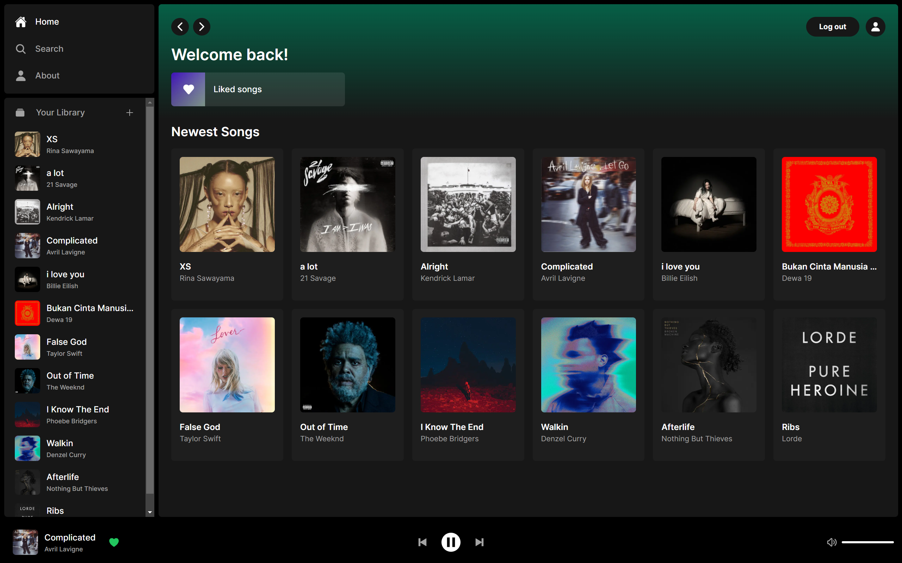

# Spotiplay

This is a full-stack music streaming website equipped with user authentication and online transactions/subscriptions modal, inspired by Spotify.

## Live Link:
[Click Here!](https://spotiplay.vercel.app/)

## Techstack:
- Typescript
- Next.js 13
- TailwindCSS
- PostgresSQL
- Supabase 
- Stripe (To be Added)

## Todo&apos;s:    
- [ ] Integrate Stripe
- [ ] Create account page
- [ ] Add subscription modal
- [x] Create about page
- [x] Add player functionality
- [x] ~~Add favorites/liked functionality~~
- [x] ~~Finish songs list display~~
- [x] ~~Finish songs fetching~~
- [x] ~~Finish upload modal & its functionality~~
- [x] ~~Create skeleton layout for main page~~
- [x] ~~Finish supabase setup~~
- [x] ~~Create supabase types~~
- [x] ~~Add auth & supabase Providers~~
- [x] ~~Create authentication modal & its functionality~~

